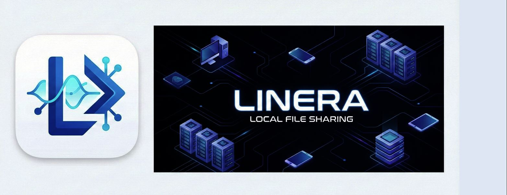
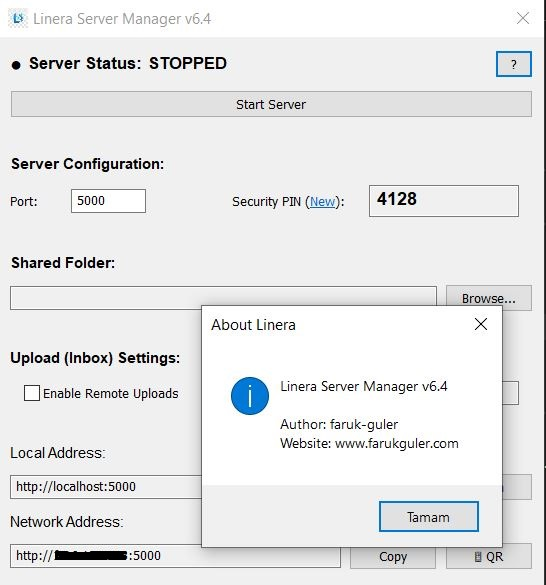

# Linera - Local File Sharing
Linera is a lightweight, high-performance, open-source tool for sharing files over your local network. It compiles into a single executable, requiring no installation and featuring a robust Windows GUI.

## Features

- **Safe & Read-Only**: Remote clients can only view and download files. Upload/Delete is strictly disabled.
- **Bulk Download**: Select multiple files/folders and download them as a single ZIP archive instantly.
- **Embedded Uploads**: Integrated, "PHP Shell" style footer for uploading directly into the current directory.
- **Full Responsive**: Optimized for Mobile, Tablet, and Desktop with a clean, modern interface.
- **Path Hardening**: Advanced path traversal protection to keep your host system secure.
- **Smart IP Detection**: Automatically identifies your local network address (WiFi/Wired) and ignores virtual adapters.
- **Folder Download**: Download entire directories as a ZIP file with a single click.
- **QR Code Sharing**: Instant mobile connection via generated QR codes.
- **One-Click Copy**: Easily copy Local or Network URLs to the clipboard.
- **Secure**: Dual PIN-based authentication (Session & Upload) that changes on every start.
- **No Console**: Runs as a clean Windows GUI application without background terminal windows.

## How to Run

1. Double-click `Linera.exe`.
2. The **Linera Server Manager** will open and automatically detect your best network IP.
3. Click **Browse...** to select the folder you want to share.
4. Verify the **Port** and **Security PINs**.
5. Enable **Remote Uploads** if you want to receive files.
6. Click **Start Server** if it's not already running.
7. Share the URLs shown in the interface.

## How to Connect from Other Devices

1. Ensure your phone/tablet is on the same Wi-Fi network.
2. Use your device's camera to scan the **📱 QR Code** or enter the **Network Address** manually.
3. Enter the current **Security PIN** displayed in the Server Manager.
4. If uploads are enabled, use the minimalist **Upload** section in the footer to send files directly into the active folder.
5. Use the selection checkboxes and the floating bar to download multiple items as a ZIP.

## Notes

- **Security**: The PINs are regenerated every time you restart.
- **Privacy**: Linera is strictly local; no data is sent outside your network.

---
Author: [faruk-guler](https://github.com/faruk-guler)
[www.farukguler.com](http://www.farukguler.com)
Version: v6.4
