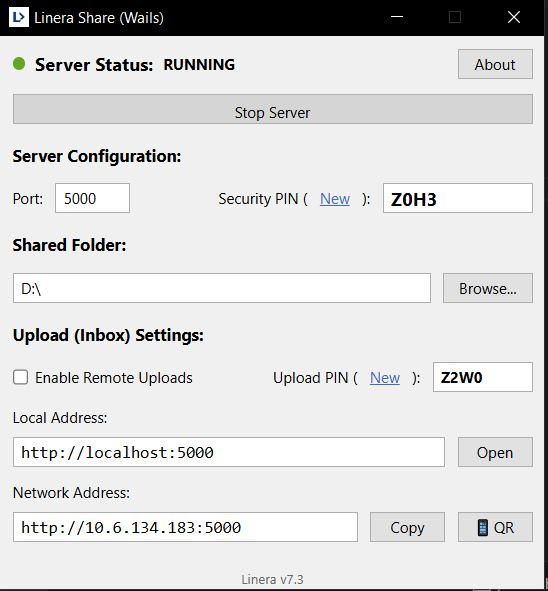

# Linera Wails Edition

Formerly Linera is a robust, local file-sharing solution rebuilt on the **Wails v2** framework. It combines a classic Windows GUI with a modern, secure Go backend to provide seamless file transfer capabilities over your local network.




## Key Features

- **Secure File Sharing**:
  - **Read-Only Mode**: Default mode allows safe browsing and downloading.
  - **Secure Uploads**: Upload capability protected by a specific, rotating PIN.
  - **Session Security**: Admin dashboard access protected by a separate session PIN.

- **Advanced Search**:
  - **Recursive Search**: Search deeply through all subdirectories.
  - **Wildcard Support**: Use `*.txt`, `image_?.png`, or other glob patterns for precise finding.
  - **Quick Filters**: Instant local filtering of current folder view.

- **User Experience**:
  - **Classic GUI**: Familiar Windows-style interface for ease of use.
  - **Web Interface**: Modern, responsive web UI for remote clients (Mobile/Desktop).
  - **QR Code**: Instant mobile connection via generated QR codes.
  - **Bulk Download**: Select multiple files/folders and download them as a single ZIP archive.
  - **No Console**: Runs cleanly in the background as a system tray application.

- **Security & Networking**:
  - **Path Hardening**: Advanced protection against path traversal attacks.
  - **Smart IP Detection**: Automatically prioritizes physical network adapters over virtual ones.

## Requirements

- **Windows 10/11** (64-bit)
- **Microsoft Edge WebView2 Runtime** — Pre-installed on most modern Windows systems. If missing, use the included `install_webview2.bat`.

## How to Run

1. Navigate to the `build/bin/` folder.
2. Double-click `Linera.exe`.
3. If prompted, allow network access.
4. **Select a Folder**: Choose the directory you wish to share via the GUI.
5. **Start Server**: Click "Start Server" to begin sharing.
6. **Connect**: Use the displayed URL or scan the QR code on other devices.

## Development

Built with:

- **Backend**: Go (Wails v2)
- **Frontend**: Vanilla HTML/CSS/JS

To build from source:

```bash
wails build
```

---
Author: [faruk-guler](https://github.com/faruk-guler)
[www.farukguler.com](http://www.farukguler.com)
Version: v7.3
